# Design Document

## Overview

The Algeria Marketplace Phase 2 Audit System is a comprehensive automated auditing tool designed to validate the technical readiness, security compliance, and production quality of the Flutter marketplace application. The system will perform multi-dimensional analysis across build environment, code quality, security, performance, and UI/UX standards to ensure the application meets banking-grade requirements for 45 million users in Algeria.

## Architecture

### System Architecture

```mermaid
graph TB
    A[Audit Controller] --> B[Environment Validator]
    A --> C[Code Quality Analyzer]
    A --> D[Security Scanner]
    A --> E[Performance Tester]
    A --> F[UI/UX Validator]
    A --> G[Report Generator]
    
    B --> B1[Flutter SDK Checker]
    B --> B2[Android Studio Validator]
    B --> B3[Gradle Build Tester]
    B --> B4[APK Generator]
    
    C --> C1[Architecture Analyzer]
    C --> C2[Code Scanner]
    C --> C3[State Management Validator]
    C --> C4[Error Handling Checker]
    
    D --> D1[Encryption Validator]
    D --> D2[Authentication Checker]
    D --> D3[Input Validation Scanner]
    D --> D4[Network Security Analyzer]
    
    E --> E1[Startup Time Measurer]
    E --> E2[Animation Performance Tester]
    E --> E3[API Response Timer]
    E --> E4[Memory Usage Monitor]
    
    F --> F1[Color Palette Validator]
    F --> F2[RTL Support Checker]
    F --> F3[Accessibility Tester]
    F --> F4[Responsive Design Validator]
    
    G --> G1[Score Calculator]
    G --> G2[Report Formatter]
    G --> G3[Action Plan Generator]
```



### Component Architecture

The audit system follows a modular architecture with the following key components:

1. **Audit Controller**: Central orchestrator that manages the execution flow
2. **Validation Modules**: Specialized modules for each audit category
3. **Report Generator**: Comprehensive reporting and scoring system
4. **Configuration Manager**: Handles audit thresholds and standards
5. **Logger**: Detailed logging and error tracking

## Components and Interfaces

### Core Components

#### 1. Audit Controller
```typescript
interface AuditController {
  executeFullAudit(): Promise<AuditResult>
  executeCategoryAudit(category: AuditCategory): Promise<CategoryResult>
  getAuditProgress(): AuditProgress
}
```

#### 2. Environment Validator
```typescript
interface EnvironmentValidator {
  validateFlutterSDK(): Promise<ValidationResult>
  validateAndroidStudio(): Promise<ValidationResult>
  validateGradleBuild(): Promise<ValidationResult>
  generateAPK(): Promise<ValidationResult>
}
```

#### 3. Code Quality Analyzer
```typescript
interface CodeQualityAnalyzer {
  analyzeArchitecture(): Promise<ArchitectureResult>
  scanForUndefinedReferences(): Promise<CodeScanResult>
  validateStateManagement(): Promise<StateManagementResult>
  checkErrorHandling(): Promise<ErrorHandlingResult>
}
```

#### 4. Security Scanner
```typescript
interface SecurityScanner {
  validateEncryption(): Promise<SecurityResult>
  checkAuthentication(): Promise<SecurityResult>
  scanInputValidation(): Promise<SecurityResult>
  analyzeNetworkSecurity(): Promise<SecurityResult>
}
```

#### 5. Performance Tester
```typescript
interface PerformanceTester {
  measureColdStartTime(): Promise<PerformanceResult>
  testAnimationPerformance(): Promise<PerformanceResult>
  measureAPIResponseTimes(): Promise<PerformanceResult>
  monitorMemoryUsage(): Promise<PerformanceResult>
}
```

#### 6. UI/UX Validator
```typescript
interface UIUXValidator {
  validateColorPalette(): Promise<UIResult>
  checkRTLSupport(): Promise<UIResult>
  testAccessibility(): Promise<UIResult>
  validateResponsiveDesign(): Promise<UIResult>
}
```

### Data Models

#### Audit Result Model
```typescript
interface AuditResult {
  overallScore: number
  categoryScores: CategoryScores
  criticalIssues: Issue[]
  warnings: Issue[]
  recommendations: Recommendation[]
  executionTime: number
  timestamp: Date
}

interface CategoryScores {
  environment: number
  codeQuality: number
  security: number
  performance: number
  uiux: number
}
```

#### Validation Result Model
```typescript
interface ValidationResult {
  passed: boolean
  score: number
  issues: Issue[]
  details: ValidationDetails
  executionTime: number
}

interface Issue {
  severity: 'CRITICAL' | 'HIGH' | 'MEDIUM' | 'LOW'
  category: string
  description: string
  location?: string
  recommendation: string
  impact: string
}
```

## Error Handling

### Error Categories

1. **System Errors**: Environment setup issues, missing dependencies
2. **Validation Errors**: Failed checks, threshold violations
3. **Runtime Errors**: Execution failures, timeouts
4. **Configuration Errors**: Invalid settings, missing configurations

### Error Handling Strategy

```typescript
class AuditErrorHandler {
  handleSystemError(error: SystemError): void
  handleValidationError(error: ValidationError): void
  handleRuntimeError(error: RuntimeError): void
  logError(error: AuditError): void
  generateErrorReport(errors: AuditError[]): ErrorReport
}
```

### Recovery Mechanisms

- **Graceful Degradation**: Continue with remaining checks if one fails
- **Retry Logic**: Automatic retry for transient failures
- **Fallback Methods**: Alternative validation approaches when primary methods fail
- **Detailed Logging**: Comprehensive error tracking for debugging

## Testing Strategy

### Unit Testing
- Individual validator components
- Data model validation
- Error handling scenarios
- Configuration management

### Integration Testing
- End-to-end audit execution
- Cross-component communication
- Report generation accuracy
- Performance under load

### Test Categories

#### 1. Environment Testing
```typescript
describe('Environment Validator', () => {
  test('should validate Flutter SDK version compatibility')
  test('should detect Android Studio integration issues')
  test('should identify Gradle build problems')
  test('should verify APK generation success')
})
```

#### 2. Security Testing
```typescript
describe('Security Scanner', () => {
  test('should detect encryption vulnerabilities')
  test('should validate authentication mechanisms')
  test('should identify input validation gaps')
  test('should check network security configuration')
})
```

#### 3. Performance Testing
```typescript
describe('Performance Tester', () => {
  test('should measure cold start time accurately')
  test('should validate 60 FPS animation performance')
  test('should verify API response times under 500ms')
  test('should monitor memory usage optimization')
})
```

### Test Data Management

- **Mock Flutter Projects**: Standardized test projects with known issues
- **Performance Benchmarks**: Baseline measurements for comparison
- **Security Test Cases**: Known vulnerabilities for validation
- **UI/UX Test Scenarios**: Standard design compliance checks

### Continuous Testing

- **Automated Test Execution**: Run tests on every audit system change
- **Regression Testing**: Ensure new features don't break existing functionality
- **Performance Regression**: Monitor audit system performance over time
- **Compatibility Testing**: Validate against different Flutter/Android versions

## Implementation Considerations

### Technology Stack
- **Language**: TypeScript/JavaScript for cross-platform compatibility
- **Testing Framework**: Jest for comprehensive testing
- **Build Tools**: Integration with existing Gradle/Flutter build system
- **Reporting**: HTML/PDF generation for comprehensive reports

### Performance Optimization
- **Parallel Execution**: Run independent validations concurrently
- **Caching**: Cache validation results to avoid redundant checks
- **Incremental Analysis**: Only re-validate changed components
- **Resource Management**: Efficient memory and CPU usage

### Scalability Considerations
- **Modular Design**: Easy addition of new validation categories
- **Configuration-Driven**: Customizable thresholds and standards
- **Plugin Architecture**: Support for custom validators
- **Multi-Project Support**: Handle multiple Flutter applications

### Security Considerations
- **Secure Execution**: Run validations in isolated environments
- **Credential Management**: Secure handling of API keys and certificates
- **Audit Trail**: Complete logging of all audit activities
- **Access Control**: Role-based access to audit results