# Design Document

## Overview

The Flutter Marketplace Crash Fixes system is designed to systematically resolve critical application startup and compilation issues that prevent the Algeria marketplace application from functioning. The design follows a sequential fix approach, addressing Android configuration mismatches, Flutter import errors, missing provider implementations, and widget components to transform a non-functional application into a stable, runnable marketplace platform.

## Architecture

### Fix Implementation Architecture

```mermaid
graph TB
    A[Fix Controller] --> B[Android Config Fixer]
    A --> C[Import Path Corrector]
    A --> D[Provider Implementer]
    A --> E[Widget Creator]
    A --> F[Build Validator]
    
    B --> B1[ApplicationId Corrector]
    B --> B2[AndroidManifest Updater]
    B --> B3[MainActivity Package Fixer]
    B --> B4[Package Structure Validator]
    
    C --> C1[Import Scanner]
    C --> C2[Path Replacer]
    C --> C3[Relative Path Generator]
    C --> C4[Import Validator]
    
    D --> D1[AuthProvider Completer]
    D --> D2[CartProvider Enhancer]
    D --> D3[User Model Expander]
    D --> D4[Provider Tester]
    
    E --> E1[ProductCard Creator]
    E --> E2[OrderCard Builder]
    E --> E3[ChatCard Implementer]
    E --> E4[CartItem Model Fixer]
    
    F --> F1[Flutter Analyzer]
    F --> F2[Build Tester]
    F --> F3[Runtime Validator]
    F --> F4[APK Generator]
```



### Sequential Fix Strategy

The design implements a dependency-aware sequential approach:

1. **Android Configuration Layer**: Foundation fixes that enable app startup
2. **Import Resolution Layer**: Compilation fixes that enable code analysis
3. **Provider Implementation Layer**: State management fixes that enable functionality
4. **Widget Creation Layer**: UI component fixes that enable rendering
5. **Validation Layer**: Comprehensive testing that ensures stability

## Components and Interfaces

### Core Fix Components

#### 1. Android Configuration Fixer
```typescript
interface AndroidConfigFixer {
  fixApplicationId(): Promise<FixResult>
  updateAndroidManifest(): Promise<FixResult>
  correctMainActivityPackage(): Promise<FixResult>
  validatePackageStructure(): Promise<FixResult>
}

interface AndroidConfigResult {
  applicationIdFixed: boolean
  manifestUpdated: boolean
  mainActivityMoved: boolean
  packageStructureValid: boolean
  errors: string[]
}
```

#### 2. Import Path Corrector
```typescript
interface ImportPathCorrector {
  scanForPackageImports(): Promise<ImportScanResult>
  generateRelativePaths(): Promise<PathMappingResult>
  replaceImportStatements(): Promise<ImportFixResult>
  validateImportResolution(): Promise<ValidationResult>
}

interface ImportFixResult {
  filesProcessed: number
  importsReplaced: number
  unresolvedImports: string[]
  errors: string[]
}
```

#### 3. Provider Implementer
```typescript
interface ProviderImplementer {
  completeAuthProvider(): Promise<ProviderResult>
  enhanceCartProvider(): Promise<ProviderResult>
  expandUserModel(): Promise<ProviderResult>
  testProviderFunctionality(): Promise<TestResult>
}

interface ProviderResult {
  methodsAdded: string[]
  propertiesAdded: string[]
  testsCreated: boolean
  functionalityVerified: boolean
}
```

#### 4. Widget Creator
```typescript
interface WidgetCreator {
  createProductCard(): Promise<WidgetResult>
  buildOrderCard(): Promise<WidgetResult>
  implementChatCard(): Promise<WidgetResult>
  fixCartItemModel(): Promise<ModelResult>
}

interface WidgetResult {
  widgetCreated: boolean
  propsImplemented: string[]
  stylingApplied: boolean
  accessibilityCompliant: boolean
}
```

### Data Models

#### Fix Result Model
```typescript
interface FixResult {
  category: FixCategory
  success: boolean
  changes: Change[]
  errors: Error[]
  warnings: Warning[]
  executionTime: number
  nextSteps: string[]
}

enum FixCategory {
  ANDROID_CONFIG = 'android_config',
  IMPORT_PATHS = 'import_paths',
  PROVIDERS = 'providers',
  WIDGETS = 'widgets',
  VALIDATION = 'validation'
}

interface Change {
  file: string
  type: 'CREATE' | 'UPDATE' | 'DELETE' | 'MOVE'
  description: string
  beforeContent?: string
  afterContent?: string
}
```

#### Validation Model
```typescript
interface ValidationResult {
  buildSuccessful: boolean
  analyzeClean: boolean
  runtimeStable: boolean
  criticalErrors: string[]
  warnings: string[]
  performanceMetrics: PerformanceMetrics
}

interface PerformanceMetrics {
  startupTime: number
  buildTime: number
  analyzeTime: number
  memoryUsage: number
}
```

## Error Handling

### Error Categories and Recovery

#### 1. Android Configuration Errors
```typescript
class AndroidConfigError extends Error {
  constructor(
    public configType: 'APPLICATION_ID' | 'MANIFEST' | 'MAIN_ACTIVITY' | 'PACKAGE_STRUCTURE',
    public originalError: string,
    public suggestedFix: string
  ) {}
}

// Recovery Strategy
const androidErrorRecovery = {
  APPLICATION_ID: () => resetToDefaultAndReconfigure(),
  MANIFEST: () => regenerateManifestFromTemplate(),
  MAIN_ACTIVITY: () => recreateMainActivityInCorrectLocation(),
  PACKAGE_STRUCTURE: () => restructurePackageDirectories()
}
```

#### 2. Import Resolution Errors
```typescript
class ImportError extends Error {
  constructor(
    public file: string,
    public importStatement: string,
    public resolutionAttempts: string[],
    public suggestedPath: string
  ) {}
}

// Recovery Strategy
const importErrorRecovery = {
  UNRESOLVED_IMPORT: (error: ImportError) => tryAlternativePaths(error),
  CIRCULAR_DEPENDENCY: (error: ImportError) => refactorCircularImports(error),
  MISSING_FILE: (error: ImportError) => createMissingFile(error)
}
```

#### 3. Provider Implementation Errors
```typescript
class ProviderError extends Error {
  constructor(
    public providerType: 'AUTH' | 'CART' | 'USER',
    public missingElements: string[],
    public dependencyIssues: string[]
  ) {}
}

// Recovery Strategy
const providerErrorRecovery = {
  MISSING_METHODS: (error: ProviderError) => implementMissingMethods(error),
  MISSING_PROPERTIES: (error: ProviderError) => addMissingProperties(error),
  DEPENDENCY_ISSUES: (error: ProviderError) => resolveDependencies(error)
}
```

### Rollback Mechanism

```typescript
interface RollbackManager {
  createCheckpoint(category: FixCategory): Promise<CheckpointId>
  rollbackToCheckpoint(checkpointId: CheckpointId): Promise<RollbackResult>
  listCheckpoints(): CheckpointInfo[]
  cleanupCheckpoints(): Promise<void>
}

interface CheckpointInfo {
  id: CheckpointId
  category: FixCategory
  timestamp: Date
  filesAffected: string[]
  description: string
}
```

## Testing Strategy

### Fix Validation Testing

#### 1. Android Configuration Testing
```typescript
describe('Android Configuration Fixes', () => {
  test('should correct applicationId in build.gradle')
  test('should update AndroidManifest.xml package')
  test('should move MainActivity to correct package')
  test('should validate complete package structure')
  test('should enable successful app startup')
})
```

#### 2. Import Resolution Testing
```typescript
describe('Import Path Corrections', () => {
  test('should identify all package:marketplace imports')
  test('should generate correct relative paths')
  test('should replace imports without breaking functionality')
  test('should resolve all import dependencies')
  test('should pass flutter analyze with zero import errors')
})
```

#### 3. Provider Implementation Testing
```typescript
describe('Provider Implementations', () => {
  test('should implement all missing AuthProvider methods')
  test('should add all required CartProvider properties')
  test('should expand User model with missing fields')
  test('should maintain existing provider functionality')
  test('should pass provider unit tests')
})
```

#### 4. Widget Creation Testing
```typescript
describe('Widget Creations', () => {
  test('should create functional ProductCard widget')
  test('should build working OrderCard widget')
  test('should implement ChatCard widget')
  test('should fix CartItem model properties')
  test('should render widgets without errors')
})
```

### Integration Testing Strategy

#### End-to-End Fix Validation
```typescript
describe('Complete Fix Integration', () => {
  test('should apply all fixes in correct sequence')
  test('should build application successfully after fixes')
  test('should start application without crashes')
  test('should navigate between screens successfully')
  test('should maintain performance within acceptable limits')
})
```

### Test Data and Scenarios

#### Pre-Fix State Simulation
- Mock broken Android configuration files
- Simulate package:marketplace import errors
- Create incomplete provider implementations
- Generate missing widget scenarios

#### Post-Fix Validation
- Verify corrected Android configuration
- Validate resolved import statements
- Test complete provider functionality
- Confirm working widget implementations

## Implementation Considerations

### Technology Stack Integration
- **Flutter SDK**: Work with existing Flutter 3.x installation
- **Android Studio**: Integrate with existing Gradle build system
- **Dart Analysis**: Leverage flutter analyze for validation
- **File System**: Direct file manipulation for configuration fixes

### Performance Optimization
- **Incremental Fixes**: Apply fixes in dependency order to minimize rework
- **Batch Operations**: Group related file changes to reduce I/O operations
- **Validation Caching**: Cache validation results to avoid redundant checks
- **Parallel Processing**: Run independent validations concurrently

### Safety Mechanisms
- **Backup Creation**: Automatic backup before applying fixes
- **Incremental Validation**: Validate after each fix category
- **Rollback Capability**: Quick rollback if fixes cause new issues
- **Progress Tracking**: Detailed logging of all fix operations

### Algeria Marketplace Specific Considerations
- **Package Naming**: Ensure "com.marketplace.algeria" consistency
- **Localization**: Maintain Arabic RTL support during fixes
- **Banking Standards**: Preserve security implementations during provider fixes
- **Performance**: Maintain startup time requirements during widget creation

### Risk Mitigation
- **Dependency Analysis**: Understand fix dependencies before implementation
- **Impact Assessment**: Evaluate potential side effects of each fix
- **Testing Coverage**: Comprehensive testing after each fix category
- **Documentation**: Detailed logging for troubleshooting and future reference