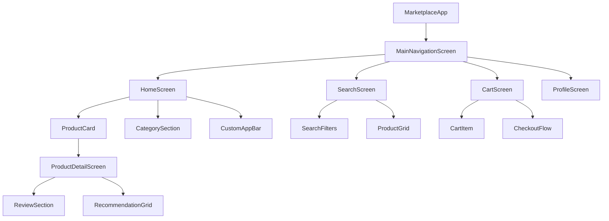
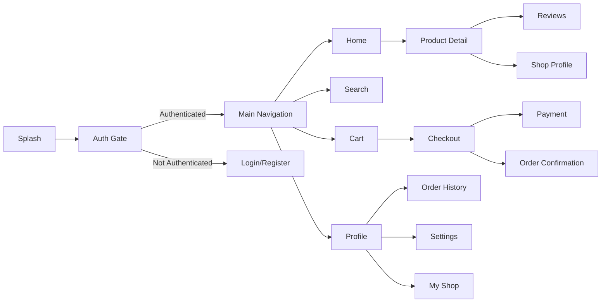
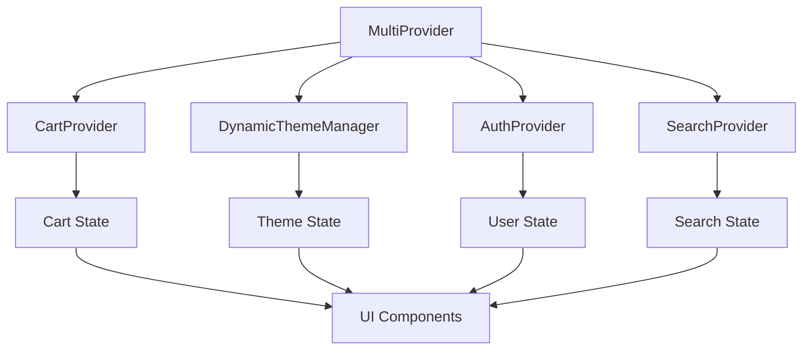
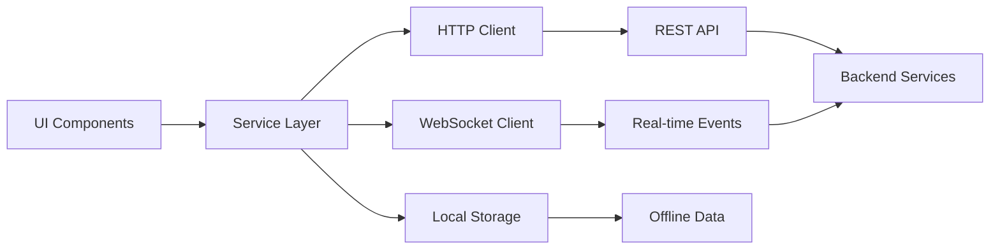

# Marketplace Mobile App - UI/UX Design Document

## Overview

This document outlines the comprehensive UI/UX design for a mobile marketplace application built with Flutter frontend and Node.js/Express backend. The app provides a full-featured e-commerce experience with advanced personalization, AI-powered search, gamification, and multi-vendor marketplace capabilities.

## Technology Stack & Dependencies

### Frontend (Flutter)
- **Flutter SDK**: Cross-platform mobile development
- **Provider**: State management for cart and theme
- **Material Design**: UI framework with custom theming
- **Custom Components**: Glassmorphic containers, particle backgrounds
- **Dynamic Theming**: Seasonal themes and customization

### Backend Integration
- **REST API**: Express.js backend with comprehensive endpoints
- **Authentication**: JWT-based with refresh tokens
- **Payment**: Stripe integration
- **Search**: Advanced AI-powered search with filters
- **Real-time**: WebSocket for messaging and notifications

## Component Architecture

### Component Definition

The mobile app is structured around modular, reusable components that follow Flutter's widget architecture:



### Component Hierarchy

#### Core Navigation Components
- **MainNavigationScreen**: Bottom navigation with 4 tabs (Home, Search, Cart, Profile)
- **CustomAppBar**: Contextual app bar with search, notifications, and chat
- **SideDrawer**: Additional navigation for shop management and settings

#### Product Components
- **ProductCard**: Displays product image, title, price, rating with glassmorphic design
- **ProductGrid**: Responsive grid layout for product listings
- **ProductDetailScreen**: Full product view with gallery, specifications, reviews
- **CategorySection**: Horizontal scrollable category chips

#### Shopping Components
- **CartProvider**: State management for cart operations
- **CartScreen**: Shopping cart with quantity controls and checkout
- **CheckoutScreen**: Multi-step payment flow with address and payment method selection
- **WishlistComponent**: Save items for later

#### User Interface Components
- **GlassmorphicContainer**: Frosted glass effect containers
- **ParticleBackground**: Animated background effects
- **DynamicThemeManager**: Seasonal and customizable themes
- **LoadingStates**: Skeleton loaders and spinners

### Props/State Management

#### Cart Provider State
```dart
class CartProvider extends ChangeNotifier {
  List<CartItem> _items = [];
  double _total = 0.0;
  String _currency = 'USD';
  
  // Methods for add, remove, update quantity
  void addItem(Product product, int quantity);
  void removeItem(String productId);
  void updateQuantity(String productId, int quantity);
  void clearCart();
}
```

#### Theme Manager State
```dart
class DynamicThemeManager extends ChangeNotifier {
  SeasonalTheme _currentTheme = SeasonalTheme.defaultBlue;
  Map<String, Color> _customColors = {};
  
  void setSeasonalTheme(SeasonalTheme theme);
  void updateCustomColors(Map<String, Color> colors);
}
```

### Lifecycle Methods/Hooks

#### Screen Lifecycle
- **initState()**: Initialize controllers, fetch initial data
- **dispose()**: Clean up controllers and subscriptions
- **didChangeDependencies()**: Handle theme and localization changes

#### Data Fetching Hooks
- **FutureBuilder**: For one-time data loading
- **StreamBuilder**: For real-time updates (messages, notifications)
- **RefreshIndicator**: Pull-to-refresh functionality

### Component Usage Examples

#### Product Card Implementation
```dart
ProductCard(
  product: Product(
    id: "prod_123",
    title: "Wireless Headphones",
    price: 99.99,
    imageUrl: "https://example.com/image.jpg",
    rating: 4.5
  ),
  onTap: () => Navigator.push(
    context,
    MaterialPageRoute(
      builder: (context) => ProductDetailScreen(productId: "prod_123")
    )
  ),
  onAddToCart: (product) => context.read<CartProvider>().addItem(product, 1),
  onAddToWishlist: (product) => wishlistService.add(product)
)
```

## Routing & Navigation

### Navigation Structure


### Route Definitions
- **/** - Splash screen with app initialization
- **/auth** - Authentication flow (login/register)
- **/home** - Main marketplace feed
- **/search** - Search with filters and AI recommendations
- **/product/:id** - Product detail view
- **/cart** - Shopping cart management
- **/checkout** - Multi-step checkout process
- **/profile** - User profile and settings
- **/shop/:id** - Individual shop/vendor page
- **/orders** - Order history and tracking

### Navigation Patterns
- **Bottom Tab Navigation**: Primary navigation between main sections
- **Stack Navigation**: Hierarchical navigation within sections
- **Modal Navigation**: Checkout flow, filters, full-screen views
- **Deep Linking**: Direct links to products and shops

## Styling Strategy

### Design System Foundation
The app implements a comprehensive design system with:

#### Color Palette
- **Primary**: Dynamic seasonal colors (Blue, Green, Purple themes)
- **Secondary**: Complementary accent colors
- **Surface**: Glassmorphic backgrounds with transparency
- **Error/Warning/Success**: Semantic color system

#### Typography Scale
```dart
TextTheme(
  displayLarge: TextStyle(fontSize: 32, fontWeight: FontWeight.bold),
  headlineMedium: TextStyle(fontSize: 24, fontWeight: FontWeight.w600),
  bodyLarge: TextStyle(fontSize: 16, fontWeight: FontWeight.normal),
  bodyMedium: TextStyle(fontSize: 14, fontWeight: FontWeight.normal),
  labelLarge: TextStyle(fontSize: 14, fontWeight: FontWeight.w500)
)
```

#### Spacing System
- **Micro**: 4px - Icon padding, border widths
- **Small**: 8px - Element spacing, chip padding  
- **Medium**: 16px - Card padding, section margins
- **Large**: 24px - Screen padding, major sections
- **XLarge**: 32px - Header spacing, modal margins

### Glassmorphic Design Language
The app features a distinctive glassmorphic design with:
- **Frosted Glass Containers**: Semi-transparent backgrounds with blur effects
- **Particle Animations**: Subtle background animations
- **Depth Layering**: Multiple transparency levels for hierarchy
- **Smooth Transitions**: 300ms ease-out animations

### Responsive Design
- **Mobile First**: Optimized for phones (320px-768px)
- **Adaptive Layouts**: Grid adjusts based on screen size
- **Touch Targets**: Minimum 44px touch targets
- **Safe Areas**: Proper handling of notches and home indicators

## State Management

### Provider Architecture


### State Categories

#### Global State (Provider)
- **CartProvider**: Shopping cart items, totals, currency
- **AuthProvider**: User authentication, profile data
- **ThemeProvider**: Color schemes, seasonal themes
- **SettingsProvider**: App preferences, language, notifications

#### Local State (StatefulWidget)
- **Form State**: Input validation, form data
- **UI State**: Loading states, modal visibility, animations
- **Screen State**: Search queries, filters, pagination

#### Persistent State
- **SharedPreferences**: User preferences, theme settings
- **Secure Storage**: Authentication tokens
- **SQLite**: Offline cart data, search history

### State Flow Patterns
- **Unidirectional Data Flow**: Actions trigger state updates
- **Optimistic Updates**: Immediate UI feedback with rollback
- **Background Sync**: Offline-first with sync on connectivity

## API Integration Layer

### Service Architecture


### Core Services

#### API Service (`api_service.dart`)
```dart
class ApiService {
  // Authentication
  Future<AuthResponse> login(String email, String password);
  Future<AuthResponse> register(UserRegistration user);
  Future<bool> refreshToken();
  
  // Products
  Future<List<Product>> getProducts({Map<String, dynamic> filters});
  Future<Product> getProduct(String id);
  Future<List<Product>> searchProducts(String query);
  
  // Cart & Orders
  Future<Cart> getCart();
  Future<Cart> addToCart(String productId, int quantity);
  Future<Order> createOrder(OrderRequest order);
  Future<PaymentResult> processPayment(PaymentRequest payment);
  
  // User & Social
  Future<List<Review>> getProductReviews(String productId);
  Future<UserProfile> getUserProfile();
  Future<List<Message>> getMessages();
}
```

#### Real-time Service (`websocket_service.dart`)
- **Order Updates**: Real-time order status changes
- **Messages**: Chat with sellers and support
- **Notifications**: Push notifications for offers, updates
- **Live Inventory**: Real-time stock level updates

#### Cache Service (`cache_service.dart`)
- **Product Cache**: Cache frequently viewed products
- **Image Cache**: Optimized image loading and caching
- **Search Cache**: Cache search results and suggestions
- **Offline Support**: Store critical data for offline access

### API Integration Patterns
- **Repository Pattern**: Abstract data sources behind clean interfaces
- **Error Handling**: Consistent error responses with user-friendly messages
- **Retry Logic**: Automatic retry for failed network requests
- **Rate Limiting**: Respect API limits and implement backoff strategies

## Feature Specifications

### Core E-commerce Features

#### 1. User Authentication & Profiles
- **Registration/Login**: Email/password with optional social login
- **Profile Management**: Personal info, shipping addresses, payment methods
- **Email Verification**: Secure account verification flow
- **Password Reset**: Secure password recovery with tokens
- **Multi-factor Authentication**: Optional 2FA for enhanced security

#### 2. Product Catalog & Discovery
- **Product Browsing**: Grid/list views with infinite scroll
- **Category Navigation**: Hierarchical category structure
- **Advanced Search**: AI-powered search with natural language processing
- **Filter & Sort**: Price, rating, brand, availability filters
- **Product Recommendations**: Personalized product suggestions

#### 3. Shopping Cart & Checkout
- **Cart Management**: Add, remove, update quantities
- **Guest Checkout**: Purchase without registration
- **Multiple Payment Methods**: Credit cards, digital wallets, bank transfers
- **Shipping Options**: Standard, express, pickup options
- **Order Tracking**: Real-time order status updates

#### 4. Vendor/Shop Management
- **Multi-vendor Support**: Individual shop pages with custom branding
- **Shop Creation**: Template-based shop setup with customization
- **Inventory Management**: Product listing, stock management
- **Order Fulfillment**: Vendor dashboard for order processing
- **Analytics Dashboard**: Sales reports, performance metrics

### Advanced Features

#### 5. AI-Powered Personalization
- **Smart Recommendations**: Machine learning-based product suggestions
- **Visual Search**: Image-based product search using Google Vision API
- **Personalized Homepage**: Customized content based on user behavior
- **Price Prediction**: AI-driven pricing recommendations
- **Chatbot Support**: Automated customer service with natural language processing

#### 6. Gamification & Engagement
- **XP System**: Points for various actions (purchases, reviews, referrals)
- **Achievement Badges**: Unlockable badges for milestones
- **Leaderboards**: User rankings and competitions  
- **Daily Challenges**: Engaging tasks with XP rewards
- **Loyalty Program**: Tiered benefits based on activity level

#### 7. Social & Community Features
- **Product Reviews**: Rich reviews with photos and ratings
- **User Ratings**: Buyer and seller rating systems
- **Wish Lists**: Save products for later purchase
- **Social Sharing**: Share products on social media
- **Follow Shops**: Get updates from favorite vendors

#### 8. Communication & Support
- **In-app Messaging**: Direct communication between buyers and sellers
- **Real-time Chat**: WebSocket-based instant messaging
- **Dispute Resolution**: Structured dispute handling system
- **Customer Support**: Integrated support ticket system
- **Push Notifications**: Order updates, messages, promotions

#### 9. Advanced Search & Discovery
- **Semantic Search**: Natural language product search
- **Voice Search**: Speech-to-text search functionality
- **Barcode Scanner**: Product identification via camera
- **Search Filters**: Advanced filtering with multiple criteria
- **Search History**: Saved searches and recent queries

#### 10. Business Intelligence
- **Analytics Tracking**: User behavior and app performance
- **A/B Testing**: Feature experimentation framework
- **Performance Monitoring**: Real-time app performance metrics
- **Conversion Tracking**: Purchase funnel analysis
- **User Engagement**: Activity tracking and retention metrics

### Technical Features

#### 11. Performance & Security
- **Caching Strategy**: Multi-layer caching for optimal performance
- **Offline Support**: Core functionality available offline
- **Security Monitoring**: Real-time threat detection
- **Rate Limiting**: API protection against abuse
- **Data Encryption**: End-to-end encryption for sensitive data

#### 12. Customization & Theming
- **Dynamic Themes**: Seasonal and customizable color schemes
- **Shop Customization**: Vendor-specific branding and layouts
- **Accessibility**: WCAG compliance with screen reader support
- **Internationalization**: Multi-language support
- **Dark/Light Mode**: User-selectable theme modes

## Testing Strategy

### Testing Pyramid

#### Unit Testing
- **Business Logic**: Core algorithms and calculations
- **State Management**: Provider state mutations
- **Utilities**: Helper functions and formatters
- **API Models**: Data serialization/deserialization

#### Widget Testing
- **Component Testing**: Individual widget behavior
- **User Interactions**: Tap, scroll, input gestures
- **State Changes**: Widget updates on state changes
- **Accessibility**: Screen reader and navigation testing

#### Integration Testing
- **API Integration**: End-to-end API communication
- **Navigation Flow**: Screen transitions and routing
- **State Persistence**: Local storage and caching
- **Payment Flow**: Complete purchase scenarios

#### End-to-End Testing
- **User Journeys**: Complete user workflows
- **Performance Testing**: App responsiveness under load
- **Cross-platform Testing**: iOS and Android compatibility
- **Regression Testing**: Automated test suites for releases

### Testing Tools
- **Flutter Test**: Unit and widget testing framework
- **Integration Test**: End-to-end testing for Flutter
- **Mockito**: API mocking for isolated testing
- **Golden Tests**: Visual regression testing
- **Firebase Test Lab**: Cloud-based device testing

### Test Coverage Goals
- **Unit Tests**: 90%+ coverage for business logic
- **Widget Tests**: 80%+ coverage for UI components
- **Integration Tests**: Critical user flows covered
- **Performance Tests**: Load testing for key scenarios

---

*This document serves as the comprehensive UI/UX design specification for the marketplace mobile application, covering all aspects from component architecture to advanced features and testing strategies.*