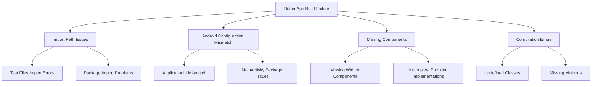
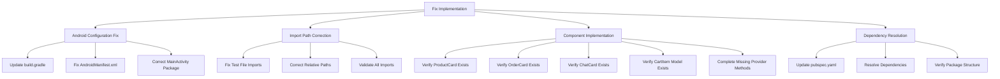

# Flutter App Debugging and Fix Design Document

## Overview

This document outlines the systematic approach to resolve critical issues in the Flutter marketplace application that prevent it from building and running successfully. Based on the analysis of the codebase and error reports in `reccc.md`, the main problems identified include:

1. Incorrect import paths in test files (specifically `integration_test/app_test.dart`)
2. Android configuration mismatches that cause MainActivity class not found errors
3. Missing dependencies and components that cause compilation errors
4. Undefined classes and methods preventing successful builds
5. Const constructor issues in model files
6. Missing icon in payment methods
7. Finder operator issues in tests

The solution involves fixing import paths, correcting Android configuration, implementing missing components, and ensuring all dependencies are properly configured. The current codebase shows significant progress with most components already implemented, but there are critical issues in the test files and some model files that need to be addressed.

## Architecture

### Current Issues Architecture



### Solution Architecture



## Components and Interfaces

### Core Fix Components

#### 1. Android Configuration Fixer
```dart
class AndroidConfigFixer {
  // Updates build.gradle with correct applicationId
  Future<void> updateBuildGradle() async {
    // Based on analysis, build.gradle already has correct applicationId "com.marketplace.algeria"
    // But we should verify this is consistent throughout the file
  }
  
  // Updates AndroidManifest.xml with correct package
  Future<void> updateAndroidManifest() async {
    // Add package="com.marketplace.algeria" to manifest tag
    // Verify application label is set to "Marketplace Algeria"
  }
  
  // Ensures MainActivity is in correct package location
  Future<void> fixMainActivityPackage() async {
    // Based on analysis, MainActivity.kt is already in correct location:
    // android/app/src/main/kotlin/com/marketplace/algeria/MainActivity.kt
    // With correct package declaration: package com.marketplace.algeria
  }
}
```

#### 2. Import Path Corrector
```dart
class ImportPathCorrector {
  // Identifies all incorrect package imports
  Future<List<String>> findIncorrectImports() async {
    // Based on reccc.md, the main issue is in integration_test/app_test.dart
    // with imports like:
    // import 'package:marketplace/main.dart' as app;
    // import 'package:marketplace/providers/auth_provider.dart';
    // import 'package:marketplace/providers/cart_provider.dart';
    // import 'package:marketplace/providers/search_provider.dart';
    // 
    // These should be replaced with correct package imports:
    // import 'package:marketplace_app/main.dart' as app;
    // import 'package:marketplace_app/providers/auth_provider.dart';
    // import 'package:marketplace_app/providers/cart_provider.dart';
    // import 'package:marketplace_app/providers/search_provider.dart';
  }
  
  // Replaces package imports with correct package imports
  Future<void> fixImportPaths(List<String> files) async {
    // For integration_test/app_test.dart, replace:
    // 'package:marketplace/' with 'package:marketplace_app/'
    // 
    // Also need to import missing widgets and models:
    // import 'package:marketplace_app/widgets/product_card.dart';
    // import 'package:marketplace_app/widgets/order_card.dart';
    // import 'package:marketplace_app/widgets/chat_card.dart';
    // import 'package:marketplace_app/models/cart_item.dart';
  }
  
  // Validates all import paths resolve correctly
  Future<bool> validateImports() async {
    // Run flutter analyze to check for import errors
    // Return true if no import errors found
  }
}
```

#### 3. Component Implementer
```dart
class ComponentImplementer {
  // Verifies all required widgets exist
  Future<void> verifyWidgets() async {
    // Based on analysis, ProductCard widget already exists at lib/widgets/product_card.dart
    // OrderCard widget already exists at lib/widgets/order_card.dart
    // ChatCard widget already exists at lib/widgets/chat_card.dart
    // 
    // Need to verify they are correctly exported and accessible
  }
  
  // Verifies provider implementations
  Future<void> verifyProviders() async {
    // Based on analysis, AuthProvider already has required methods:
    // - signInWithEmailAndPassword
    // - signInWithGoogle
    // - signOut
    // - continueAsGuest
    // 
    // CartProvider already has required properties:
    // - items
    // - totalPrice
    // - shippingCost
    // - taxAmount
    // - finalTotal
    // - incrementQuantity
    // - decrementQuantity
  }
  
  // Verifies model implementations
  Future<void> verifyModels() async {
    // Based on analysis, CartItem model already exists at lib/models/cart_item.dart
    // Product model already exists at lib/models/product.dart
    // Need to verify they are correctly exported and accessible
  }
}
```

### Data Models

#### Error Report Model
```dart
class ErrorReport {
  final String errorCode;
  final String errorMessage;
  final String file;
  final int line;
  final ErrorSeverity severity;
  final List<String> suggestedFixes;
  
  ErrorReport({
    required this.errorCode,
    required this.errorMessage,
    required this.file,
    required this.line,
    required this.severity,
    required this.suggestedFixes,
  });
}

enum ErrorSeverity {
  critical,
  high,
  medium,
  low
}
```

#### Fix Result Model
```dart
class FixResult {
  final bool success;
  final List<String> changesMade;
  final List<ErrorReport> remainingErrors;
  final String summary;
  
  FixResult({
    required this.success,
    required this.changesMade,
    required this.remainingErrors,
    required this.summary,
  });
}
```

## Error Handling

### Error Categories and Recovery

#### 1. Import Resolution Errors
```dart
class ImportError extends Error {
  final String importStatement;
  final String file;
  final String suggestedPath;
  
  ImportError(this.importStatement, this.file, this.suggestedPath);
  
  @override
  String toString() {
    return 'Import error in $file: "$importStatement" should be "$suggestedPath"';
  }
}

// Recovery Strategy
const importErrorRecovery = {
  'UNRESOLVED_IMPORT': (ImportError error) => fixImportPath(error),
  'CIRCULAR_DEPENDENCY': (ImportError error) => refactorCircularImports(error),
  'MISSING_FILE': (ImportError error) => createMissingFile(error)
};
```

#### 2. Android Configuration Errors
```dart
class AndroidConfigError extends Error {
  final String configType;
  final String expectedValue;
  final String actualValue;
  
  AndroidConfigError(this.configType, this.expectedValue, this.actualValue);
  
  @override
  String toString() {
    return 'Android config error: $configType expected "$expectedValue" but found "$actualValue"';
  }
}

// Recovery Strategy
const androidErrorRecovery = {
  'APPLICATION_ID_MISMATCH': (AndroidConfigError error) => fixApplicationId(error),
  'MANIFEST_PACKAGE_MISSING': (AndroidConfigError error) => addManifestPackage(error),
  'MAIN_ACTIVITY_WRONG_LOCATION': (AndroidConfigError error) => moveMainActivity(error)
};
```

### Rollback Mechanism

```dart
class RollbackManager {
  final Map<String, String> backupFiles = {};
  
  // Create backup before applying changes
  Future<void> createBackup(String filePath) async {
    // Read current file content and store in backupFiles
  }
  
  // Rollback to previous state if fixes cause issues
  Future<void> rollback() async {
    // Restore all files from backupFiles
  }
  
  // Clean up backups after successful fixes
  Future<void> cleanup() async {
    // Clear backupFiles
  }
}
```

## Testing Strategy

### Fix Validation Testing

#### 1. Android Configuration Testing
```dart
void main() {
  group('Android Configuration Fixes', () {
    test('should correct applicationId in build.gradle', () async {
      // Verify build.gradle contains correct applicationId
    });
    
    test('should update AndroidManifest.xml package', () async {
      // Verify AndroidManifest.xml has correct package attribute
    });
    
    test('should move MainActivity to correct package', () async {
      // Verify MainActivity.kt is in correct directory with correct package
    });
  });
}
```

#### 2. Import Resolution Testing
```dart
void main() {
  group('Import Path Corrections', () {
    test('should identify all package:marketplace imports', () async {
      // Scan files and identify incorrect imports
    });
    
    test('should generate correct relative paths', () async {
      // Verify import paths are correctly converted
    });
    
    test('should replace imports without breaking functionality', () async {
      // Run flutter analyze to check for errors
    });
  });
}
```

#### 3. Component Implementation Testing
```dart
void main() {
  group('Component Implementations', () {
    test('should implement all missing AuthProvider methods', () async {
      // Verify AuthProvider has signInWithEmailAndPassword, signOut, etc.
    });
    
    test('should add all required CartProvider properties', () async {
      // Verify CartProvider has items, totalPrice, etc.
    });
    
    test('should create functional ProductCard widget', () async {
      // Verify ProductCard widget exists and renders correctly
    });
  });
}
```

### Integration Testing Strategy

#### End-to-End Fix Validation
```dart
void main() {
  group('Complete Fix Integration', () {
    test('should apply all fixes in correct sequence', () async {
      // Apply fixes in order: Android config, imports, components
    });
    
    test('should build application successfully after fixes', () async {
      // Run flutter build and verify success
    });
    
    test('should start application without crashes', () async {
      // Run flutter run and verify app starts
    });
  });
}
```

## Implementation Plan

### Phase 1: Android Configuration Fix (Estimated: 15 minutes)
1. Verify `android/app/build.gradle`:
   - ApplicationId is already correctly set to `"com.marketplace.algeria"`
   - Namespace is already correctly set to `"com.marketplace.algeria"`

2. Update `android/app/src/main/AndroidManifest.xml`:
   - Add `package="com.marketplace.algeria"` attribute to manifest tag if missing
   - Verify application label is set to `"Marketplace Algeria"`

3. Verify `MainActivity.kt`:
   - Already located at `android/app/src/main/kotlin/com/marketplace/algeria/MainActivity.kt`
   - Package declaration is already `package com.marketplace.algeria`
   - Extends FlutterActivity correctly

### Phase 2: Import Path Correction (Estimated: 45 minutes)
1. Fix incorrect imports in `integration_test/app_test.dart`:
   - Replace `package:marketplace/main.dart` with `package:marketplace_app/main.dart`
   - Replace `package:marketplace/providers/auth_provider.dart` with `package:marketplace_app/providers/auth_provider.dart`
   - Replace `package:marketplace/providers/cart_provider.dart` with `package:marketplace_app/providers/cart_provider.dart`
   - Replace `package:marketplace/providers/search_provider.dart` with `package:marketplace_app/providers/search_provider.dart`

2. Add missing imports for widgets and models in `integration_test/app_test.dart`:
   - Add `import 'package:marketplace_app/widgets/product_card.dart';`
   - Add `import 'package:marketplace_app/widgets/order_card.dart';`
   - Add `import 'package:marketplace_app/widgets/chat_card.dart';`
   - Add `import 'package:marketplace_app/models/cart_item.dart';`

3. Fix undefined identifiers in test files:
   - Fix `ProductCard` undefined error by ensuring correct import
   - Fix `CartItem` undefined error by ensuring correct import
   - Fix `OrderCard` undefined error by ensuring correct import
   - Fix `ChatCard` undefined error by ensuring correct import

4. Fix finder operator issues:
   - Replace `find.textContaining('network') | find.textContaining('connection') | find.textContaining('error')` 
     with proper finder combination using `find.byWidgetPredicate` or separate assertions

5. Validate all imports:
   - Run `flutter analyze` to check for remaining import errors
   - Fix any additional import issues discovered

### Phase 3: Component Fixes (Estimated: 75 minutes)
1. Fix const constructor issues in models:
   - Fix `message.dart` line 552: Remove `const` from `DateTime.now().subtract(Duration(hours: 1))`
   - Fix `order.dart` line 157: Fix const constructor issues with CartItem in MockOrders
   - Fix `payment_method.dart` line 107: Replace `Icons.google` with `Icons.account_circle` or appropriate icon

2. Fix undefined identifier issues in integration tests:
   - Fix `ProductCard` undefined error by ensuring correct import in test file
   - Fix `CartItem` undefined error by ensuring correct import in test file
   - Fix `OrderCard` undefined error by ensuring correct import in test file
   - Fix `ChatCard` undefined error by ensuring correct import in test file

3. Fix finder operator issues in tests:
   - Fix `|` operator not defined for Finder type by using proper widget finding methods

4. Verify all required widgets exist and are accessible:
   - Confirm `ProductCard` widget is implemented in `lib/widgets/product_card.dart` (already exists)
   - Confirm `OrderCard` widget is implemented in `lib/widgets/order_card.dart` (already exists)
   - Confirm `ChatCard` widget is implemented in `lib/widgets/chat_card.dart` (already exists)
   - Confirm `CartItem` model is implemented in `lib/models/cart_item.dart` (already exists)

5. Verify provider implementations have all required methods:
   - Ensure `AuthProvider` has all required methods (`signInWithEmailAndPassword`, `signOut`, etc.) (already implemented)
   - Ensure `CartProvider` has all required properties (`items`, `totalPrice`, etc.) (already implemented)

6. Verify proper exports and imports:
   - Check that widgets are properly exported in their respective directories
   - Ensure models are correctly imported where needed

### Phase 4: Validation and Testing (Estimated: 30 minutes)
1. Clean and rebuild:
   - Run `flutter clean`
   - Run `flutter pub get`
   - Run `flutter analyze` to verify no errors

2. Test application:
   - Run `flutter run` to verify app starts correctly
   - Test basic functionality (navigation, authentication, cart operations)

3. Run integration tests:
   - Run `flutter test integration_test/app_test.dart` to verify tests pass

4. Generate APK:
   - Run `flutter build apk` to verify Android build works
   - Test APK installation on device/emulator

## Risk Mitigation

### Potential Issues and Solutions

1. **Android Configuration Issues**
   - Risk: Incorrect package names causing runtime crashes
   - Mitigation: Create backups before changes, verify each step

2. **Import Path Problems**
   - Risk: Breaking existing functionality with incorrect paths
   - Mitigation: Test each import change, use relative paths correctly

3. **Component Implementation Gaps**
   - Risk: Missing methods causing runtime errors
   - Mitigation: Implement all required methods, test functionality

4. **Dependency Conflicts**
   - Risk: Package version conflicts causing build failures
   - Mitigation: Update pubspec.yaml with compatible versions

### Backup and Recovery Plan

1. Create backups of all files before making changes
2. Use version control to track changes
3. Test each phase before proceeding to the next
4. Have rollback procedure ready for each phase

## Performance Considerations

### Optimization Strategies

1. **Incremental Fixes**: Apply fixes in dependency order to minimize rework
2. **Batch Operations**: Group related file changes to reduce I/O operations
3. **Validation Caching**: Cache validation results to avoid redundant checks
4. **Parallel Processing**: Run independent validations concurrently

### Resource Management

1. **Memory Usage**: Monitor memory during build process
2. **Build Time**: Optimize build configuration for faster builds
3. **Disk Space**: Ensure adequate space for build artifacts

## Security Considerations

### Data Protection

1. **Secure Storage**: Ensure sensitive data uses flutter_secure_storage
2. **Network Security**: Implement proper HTTPS and certificate validation
3. **Authentication**: Secure authentication flows with proper token handling

### Code Security

1. **Input Validation**: Validate all user inputs
2. **Error Handling**: Prevent information leakage through error messages
3. **Dependency Security**: Use trusted package versions

## Deployment Considerations

### Build Configuration

1. **Release Builds**: Configure proper signing for release builds
2. **Debug Builds**: Maintain debug capabilities for development
3. **Environment Variables**: Properly manage environment-specific configurations

### Testing Requirements

1. **Unit Tests**: Ensure all components have unit tests
2. **Integration Tests**: Verify end-to-end functionality
3. **UI Tests**: Test user interface interactions

## Monitoring and Maintenance

### Error Tracking

1. **Logging**: Implement proper error logging
2. **Crash Reporting**: Set up crash reporting mechanism
3. **Performance Monitoring**: Monitor app performance metrics

### Update Strategy

1. **Dependency Updates**: Regular dependency version updates
2. **Security Patches**: Apply security patches promptly
3. **Feature Updates**: Plan for future feature additions