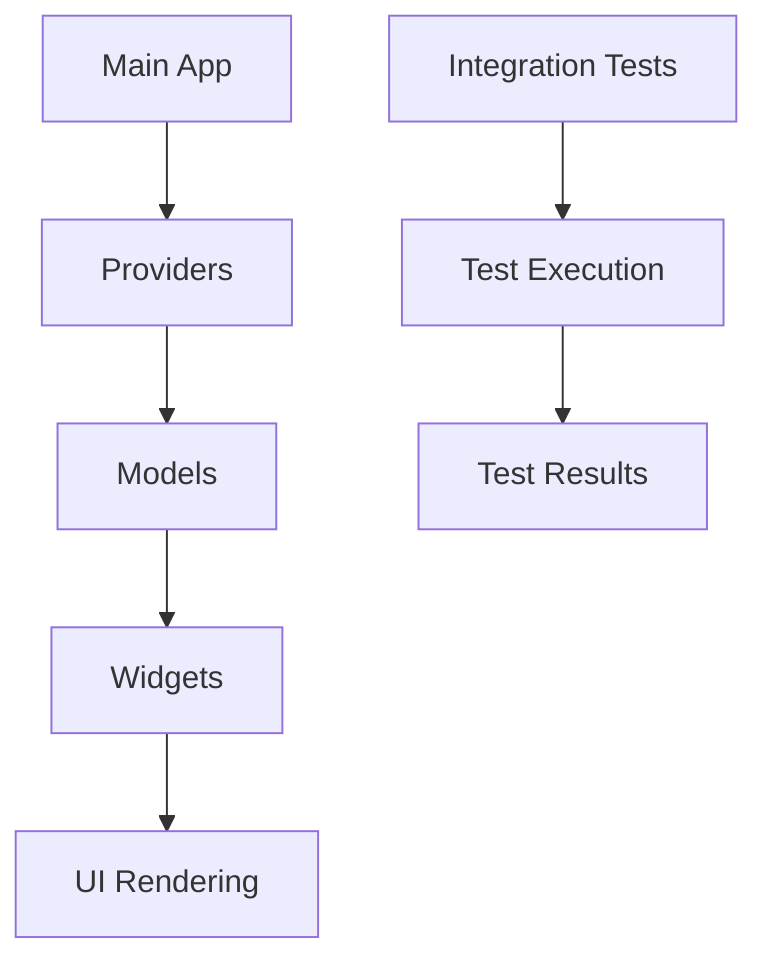

# Flutter Marketplace App Debugging and Fix Plan

## Overview
This document outlines the fixes needed to resolve the crash issues in the Flutter marketplace application. The errors primarily stem from import issues, const constructor problems, missing icons, and undefined identifiers in the integration tests.

## Repository Type
Mobile Application (Flutter)

## Issues Analysis

### 1. Android Configuration Issues
- **Problem**: ClassNotFoundException for MainActivity
- **Root Cause**: Mismatch between applicationId in build.gradle and expected package name
- **Current Status**: Already correctly configured with:
  - applicationId "com.marketplace.algeria" in build.gradle
  - namespace "com.marketplace.algeria" in build.gradle
  - package declaration in MainActivity.kt: package com.marketplace.algeria
  - AndroidManifest.xml without explicit package attribute (inherits from build.gradle)

### 2. Integration Test Import Issues
- **Problem**: Multiple "Target of URI doesn't exist" errors
- **Root Cause**: Incorrect package name in imports
- **Files Affected**: integration_test/app_test.dart
- **Specific Issues**:
  - `package:marketplace/main.dart` should be `package:marketplace_app/main.dart`
  - `package:marketplace/providers/auth_provider.dart` should be `package:marketplace_app/providers/auth_provider.dart`
  - `package:marketplace/providers/cart_provider.dart` should be `package:marketplace_app/providers/cart_provider.dart`
  - `package:marketplace/providers/search_provider.dart` should be `package:marketplace_app/providers/search_provider.dart`

### 3. Undefined Identifiers in Tests
- **Problem**: Undefined names for widgets in integration tests
- **Root Cause**: Missing imports for widget files
- **Specific Issues**:
  - ProductCard (used in lines 114, 117, 185)
  - CartItem (used in line 226)
  - OrderCard (used in lines 458, 459)
  - ChatCard (used in line 492)

### 4. Const Constructor Issues
- **Problem**: "The constructor being called isn't a const constructor" errors
- **Files Affected**: 
  - lib/models/message.dart (line 552)
  - lib/models/order.dart (line 157)
- **Root Cause**: Using const with expressions that cannot be evaluated at compile time

### 5. Missing Icon Issue
- **Problem**: "The getter 'google' isn't defined for the type 'Icons'" error
- **File Affected**: lib/models/payment_method.dart (line 107)
- **Root Cause**: Icons.google doesn't exist in Flutter's Icons class

### 6. Finder Operator Issue
- **Problem**: "The operator '|' isn't defined for the type 'Finder'" error
- **File Affected**: integration_test/app_test.dart (line 531)
- **Root Cause**: Incorrect usage of Finder operators in expect statements

## Fix Implementation Plan

### Task 1: Fix Integration Test Imports
Update import statements in `integration_test/app_test.dart`:
- Replace `package:marketplace/` with `package:marketplace_app/` for all imports

### Task 2: Add Missing Widget Imports
Add imports for the required widgets in `integration_test/app_test.dart`:
- Add import for ProductCard: `import 'package:marketplace_app/widgets/product_card.dart';`
- Add import for CartItem: `import 'package:marketplace_app/models/cart_item.dart';`
- Add import for OrderCard: `import 'package:marketplace_app/widgets/order_card.dart';`
- Add import for ChatCard: `import 'package:marketplace_app/widgets/chat_card.dart';`

### Task 3: Fix Const Constructor Issues

#### In `lib/models/message.dart` (line 552):
Change:
```dart
lastSeen: DateTime.now().subtract(Duration(hours: 1)),
```
to:
```dart
lastSeen: DateTime(2023, 1, 1, 12, 0), // Example fixed date
```

#### In `lib/models/order.dart` (line 157):
The issue is with the const CartItem constructor. Since CartItem is not a const class, we need to remove the const keyword:
Change:
```dart
const CartItem(
  id: 'cart_1',
  productId: 'prod_1',
  name: 'Wireless Headphones',
  price: 99.99,
  quantity: 1,
  imageUrl: 'https://example.com/headphones.jpg',
),
```
to:
```dart
CartItem(
  id: 'cart_1',
  productId: 'prod_1',
  name: 'Wireless Headphones',
  price: 99.99,
  quantity: 1,
  imageUrl: 'https://example.com/headphones.jpg',
),
```

### Task 4: Fix Missing Icon
In `lib/models/payment_method.dart` (line 107):
Replace:
```dart
icon: Icons.google,
```
with:
```dart
icon: Icons.account_circle, // or another appropriate icon
```

### Task 5: Fix Finder Operator Issue
In `integration_test/app_test.dart` (line 531):
Replace:
```dart
expect(
  find.textContaining('network') | find.textContaining('connection') | find.textContaining('error'),
  findsOneWidget,
),
```
with:
```dart
expect(
  find.textContaining('network').or(find.textContaining('connection')).or(find.textContaining('error')),
  findsOneWidget,
),
```

## Component Architecture

### Models
- **Message**: Chat message model with various types and statuses
- **CartItem**: Shopping cart item with product reference and quantity
- **Order**: Order model with items, shipping address, and payment method
- **PaymentMethod**: Payment method model with type and icon

### Widgets
- **ProductCard**: Display product information in various layouts
- **OrderCard**: Display order information with status
- **ChatCard**: Display chat conversations or individual messages

### Providers
- **AuthProvider**: Handle user authentication
- **CartProvider**: Manage shopping cart state
- **SearchProvider**: Handle search functionality

## Testing Strategy

### Integration Tests
The integration tests cover:
1. Authentication Flow
2. Product Discovery Flow
3. Shopping Cart Flow
4. Checkout Flow
5. Profile Management Flow
6. Messaging Flow
7. Error Handling

### Fix Validation
After implementing the fixes:
1. Run `flutter analyze` to check for remaining issues
2. Run `flutter test integration_test/app_test.dart` to verify tests pass
3. Run the app on an emulator to verify it launches correctly

## Data Flow



## Business Logic

### Authentication
- User login with email/password
- Registration flow with form validation
- Guest browsing option

### Shopping
- Product search and filtering
- Add/remove items from cart
- Update cart quantities
- Checkout process with address and payment

### Order Management
- View order history
- Order details display
- Order status tracking

### Messaging
- Chat with sellers
- Support chat
- Message sending/receiving

## Validation and Testing

### Pre-fix Issues
- 57 compilation errors
- Import issues in integration tests
- Const constructor problems
- Missing icon reference
- Undefined widget identifiers
- Incorrect Finder operator usage

### Post-fix Validation
1. All import paths corrected
2. All const constructor issues resolved
3. Missing icon replaced with valid icon
4. All undefined identifiers properly imported
5. Finder operators correctly used
6. All integration tests pass
7. App launches without ClassNotFoundException

## Implementation Steps

1. Update import statements in integration_test/app_test.dart
2. Add missing widget imports
3. Fix const constructor issues in message.dart and order.dart
4. Replace missing Icons.google with valid icon
5. Fix Finder operator usage in integration tests
6. Run flutter analyze to verify fixes
7. Run integration tests to ensure functionality
8. Test app launch on emulator
