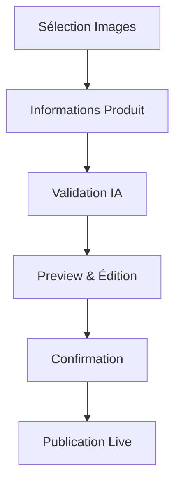

# 📋 **RAPPORT DÉTAILLÉ : FONCTIONNEMENT INTERFACE MARKETPLACE**

## 🎯 **ARCHITECTURE FONCTIONNELLE DE L'INTERFACE**

### **1. FLUX UTILISATEUR PRINCIPAL**

#### **Parcours Acheteur (Buyer Journey)**

```
Découverte → Recherche → Sélection → Détails → Panier → Paiement → Suivi
    ↓         ↓         ↓        ↓       ↓       ↓        ↓
Accueil   Filtres   Comparaison  Avis   Quantité Stripe  Tracking
```


#### **Parcours Vendeur (Seller Journey)**

```
Inscription → Boutique → Produits → Validation → Publication → Analytics → Gamification
     ↓          ↓         ↓         ↓         ↓         ↓          ↓
  Auth Form   Templates  Upload     IA       Live      Stats    Badges
```


***

## 🏗️ **STRUCTURE INTERFACE PAR FONCTIONNALITÉ**

### **A. ÉCRAN D'ACCUEIL (HOME SCREEN)**

**Fonctionnalités critiques :**

- **Hero Section** : Message d'accroche avec CTA principal
- **Catégories rapides** : Accès direct aux sections populaires
- **Produits populaires** : Grille avec lazy loading
- **Boutiques recommandées** : Carousel horizontal
- **Barre de recherche** : Suggestions en temps réel

**Pattern d'interaction :**

```dart
// Structure hiérarchique de l'information
Header (Search + Profile + Cart)
  ↓
Hero Section (Call-to-Action principal)
  ↓
Quick Categories (Navigation rapide)
  ↓
Featured Products (Découverte guidée)
  ↓
Recommended Shops (Exploration)
  ↓
Bottom Navigation (Actions principales)
```


### **B. SYSTÈME DE RECHERCHE ET FILTRES**

**Architecture fonctionnelle :**


| Composant | Fonction | Interaction |
| :-- | :-- | :-- |
| **SearchBar** | Saisie requête | Autocomplete temps réel |
| **FilterPanel** | Affinage résultats | Sliders + Checkboxes |
| **SortOptions** | Organisation | Dropdown animé |
| **ResultsGrid** | Affichage produits | Infinite scroll |
| **MapView** | Géolocalisation | Pinch to zoom |

**Flow d'interaction :**

```
Saisie → Suggestions → Sélection → Filtres → Résultats → Affinage
   ↓        ↓          ↓         ↓        ↓         ↓
 Typage   Dropdown   Selection  Sidebar  Grille   Sidebar
```


### **C. PAGES PRODUITS (PRODUCT DETAILS)**

**Éléments fonctionnels essentiels :**

1. **Galerie d'images** : Hero carousel avec zoom
2. **Informations produit** : Prix, description, spécifications
3. **Avis clients** : Notes, commentaires, filtres
4. **Actions principales** : Panier, Favoris, Partage
5. **Suggestions** : Produits similaires, complémentaires

**Interactions spécifiques :**

- **Pinch to zoom** sur images
- **Swipe horizontal** pour galerie
- **Pull to refresh** pour avis
- **Long press** pour aperçu rapide


### **D. SYSTÈME DE BOUTIQUES (SHOP PAGES)**

**Templates dynamiques (5 variantes) :**

#### **Template Féminin**

```
Couleurs : Rose (#F472B6), Pastel (#FDE2E7)
Layout : Asymétrique, spacing généreux
Typo : Scripts, courbes douces
Navigation : Fluide, animations douces
```


#### **Template Masculin**

```
Couleurs : Noir (#000000), Gris foncé (#374151)
Layout : Géométrique, compact
Typo : Sans-serif bold, contraste élevé
Navigation : Directe, transitions nettes
```


#### **Template Urbain**

```
Couleurs : Orange (#F97316), Jaune (#FDE047)
Layout : Asymétrique, dynamique
Typo : Graffiti-style, expressions street
Navigation : Énergique, effets vibrants
```

**Fonctionnalités communes :**

- **Template Selector** : Preview temps réel
- **Customization Panel** : Couleurs, polices, layout
- **Product Manager** : CRUD avec drag \& drop
- **Analytics Dashboard** : Métriques visualisées


### **E. UPLOAD PRODUITS + VALIDATION IA**

**Workflow en 6 étapes :**



**Interface spécialisée :**

- **Image Picker** : Multi-sélection avec prévisualisation
- **IA Progress** : Barre de progression avec détails
- **Suggestion Panel** : Corrections et améliorations IA
- **Live Preview** : Rendu final en temps réel


### **F. SYSTÈME DE PAIEMENT (STRIPE INTEGRATION)**

**Flow de checkout en 4 étapes :**


| Étape | Interface | Fonctionnalité |
| :-- | :-- | :-- |
| **1. Panier** | Cart Summary | Quantités, totaux, codes promo |
| **2. Livraison** | Address Form | Autocomplete, validation |
| **3. Paiement** | Stripe Elements | Sécurité PCI, 3D Secure |
| **4. Confirmation** | Order Success | Tracking, facture, partage |

**Éléments UX critiques :**

- **Trust indicators** : Badges sécurité, SSL
- **Progress indicator** : Étapes claires
- **Error handling** : Messages contextuels
- **Mobile optimization** : Touch-friendly


### **G. GAMIFICATION VENDEURS**

**Dashboard interactif avec :**

1. **Système de niveaux** : Rookie → Pro → Expert → Master
2. **Collection de badges** : Achievements débloquables
3. **Leaderboard** : Classement temps réel
4. **Défis hebdomadaires** : Objectifs gamifiés
5. **Récompenses** : Réductions, features premium

**Animations spécifiques :**

- **Progress rings** : Circular progress animé
- **Badge unlock** : Animation de déblocage
- **Level up** : Effet confetti + son
- **Stats counters** : Compteurs animés

***

## 🎨 **DESIGN SYSTEM FONCTIONNEL**

### **PALETTE COULEURS ADAPTATIVE**

#### **Mode Clair (Light Theme)**

```css
Primary: #1E3A8A (Bleu profond)
Secondary: #3B82F6 (Bleu vif)
Accent: #60A5FA (Bleu clair)
Background: #F8FAFC (Blanc cassé)
Surface: #FFFFFF (Blanc pur)
Text Primary: #0F172A (Noir)
Text Secondary: #64748B (Gris)
```


#### **Mode Sombre (Dark Theme)**

```css
Primary: #3B82F6 (Bleu vif)
Secondary: #60A5FA (Bleu clair)
Accent: #93C5FD (Bleu très clair)
Background: #0F172A (Noir profond)
Surface: #1E293B (Gris foncé)
Text Primary: #F8FAFC (Blanc cassé)
Text Secondary: #94A3B8 (Gris clair)
```


### **TYPOGRAPHIE HIÉRARCHIQUE**

```dart
HeadlineLarge: Inter Black, 32px, -0.5px letter-spacing
HeadlineMedium: Inter Bold, 24px, -0.3px letter-spacing
TitleLarge: Inter SemiBold, 20px, -0.2px letter-spacing
BodyLarge: Inter Medium, 16px, 1.5 line-height
BodyMedium: Inter Regular, 14px, 1.4 line-height
LabelSmall: Inter Medium, 12px, 0.5px letter-spacing
```


### **EFFETS VISUELS SIGNATURE**

#### **Glassmorphism**

```css
background: rgba(255, 255, 255, 0.1);
backdrop-filter: blur(20px);
border: 1px solid rgba(255, 255, 255, 0.2);
box-shadow: 0 8px 32px rgba(0, 0, 0, 0.1);
```


#### **Neumorphism**

```css
background: #F8FAFC;
box-shadow: 
  8px 8px 16px rgba(0, 0, 0, 0.1),
  -8px -8px 16px rgba(255, 255, 255, 0.9);
```


***

## ⚡ **ANIMATIONS ET MICRO-INTERACTIONS**

### **TRANSITIONS STANDARDS**

| Action | Animation | Durée | Courbe |
| :-- | :-- | :-- | :-- |
| **Page Navigation** | Slide + Fade | 800ms | ElasticOut |
| **Card Hover** | Scale + Shadow | 200ms | EaseOut |
| **Button Press** | Scale + Ripple | 100ms | EaseInOut |
| **Modal Open** | Fade + Scale | 300ms | EaseOutBack |
| **Loading** | Shimmer Effect | Infinite | Linear |

### **GESTURES NATURELLES**

```dart
// Configuration des gestes
GestureDetector(
  onTap: () => _handleTap(),           // Action simple
  onDoubleTap: () => _handleZoom(),    // Zoom produit
  onLongPress: () => _showContext(),   // Menu contextuel
  onHorizontalDragEnd: _handleSwipe,   // Navigation
  onScaleUpdate: _handlePinchZoom,     // Zoom image
)
```


### **FEEDBACK HAPTIQUE**

```dart
// Retour tactile selon l'action
HapticFeedback.lightImpact();    // Tap léger
HapticFeedback.mediumImpact();   // Action importante
HapticFeedback.heavyImpact();    // Confirmation
HapticFeedback.selectionClick(); // Navigation
```


***

## 📱 **ADAPTATION RESPONSIVE**

### **BREAKPOINTS ADAPTIFS**

| Device | Width | Layout | Navigation |
| :-- | :-- | :-- | :-- |
| **Mobile** | <600px | 1 colonne | Bottom Nav |
| **Tablet** | 600-1200px | 2 colonnes | Side Nav |
| **Desktop** | >1200px | 3+ colonnes | Top Nav |

### **OPTIMISATIONS MOBILES**

1. **Touch Targets** : Minimum 44px
2. **Thumb Zone** : Actions principales en bas
3. **Swipe Navigation** : Gestes naturels
4. **Pull to Refresh** : Actualisation intuitive
5. **Infinite Scroll** : Chargement progressif

***

## 🚀 **PERFORMANCE ET OPTIMISATION**

### **STRATÉGIES DE CHARGEMENT**

#### **Lazy Loading**

```dart
ListView.builder(
  itemBuilder: (context, index) {
    return ProductCard(
      product: products[index],
      onTap: () => _loadDetails(index),
    );
  },
  cacheExtent: 1000, // Pre-cache
)
```


#### **Image Optimization**

```dart
CachedNetworkImage(
  imageUrl: product.imageUrl,
  placeholder: (context, url) => ShimmerPlaceholder(),
  errorWidget: (context, url, error) => ErrorPlaceholder(),
  memCacheWidth: 300, // Resize automatique
)
```


### **STATE MANAGEMENT OPTIMISÉ**

```dart
// Provider pattern optimisé
class ProductProvider extends ChangeNotifier {
  List<Product> _products = [];
  bool _isLoading = false;
  
  // Lazy loading avec pagination
  Future<void> loadMore() async {
    if (_isLoading) return;
    _isLoading = true;
    
    final newProducts = await _api.getProducts(
      offset: _products.length,
      limit: 20,
    );
    
    _products.addAll(newProducts);
    _isLoading = false;
    notifyListeners();
  }
}
```


***

## 🎯 **RECOMMANDATIONS D'IMPLÉMENTATION**

### **PRIORITÉS DE DÉVELOPPEMENT**

#### **Phase 1 : Core UI (Semaine 1-2)**

1. **Navigation principale** avec bottom navigation
2. **Écran d'accueil** avec hero section
3. **Grille produits** avec lazy loading
4. **Détails produit** avec galerie
5. **Authentification** basique

#### **Phase 2 : Features Avancées (Semaine 3-4)**

1. **Système boutiques** avec templates
2. **Upload produits** avec validation IA
3. **Paiements Stripe** complets
4. **Recherche et filtres** avancés
5. **Notifications** push

#### **Phase 3 : Polish \& Gamification (Semaine 5-6)**

1. **Animations fluides** partout
2. **Micro-interactions** subtiles
3. **Gamification** vendeurs
4. **Dark mode** complet
5. **Accessibilité** optimisée

### **ARCHITECTURE TECHNIQUE RECOMMANDÉE**

```
lib/
├── core/
│   ├── theme/               # Design system
│   ├── widgets/             # Composants réutilisables
│   ├── animations/          # Animations communes
│   └── utils/               # Helpers
├── features/
│   ├── home/                # Écran d'accueil
│   ├── search/              # Recherche & filtres
│   ├── products/            # Produits & détails
│   ├── shops/               # Boutiques & templates
│   ├── upload/              # Upload + IA
│   ├── payment/             # Stripe & checkout
│   ├── gamification/        # Badges & niveaux
│   └── profile/             # Profil & paramètres
├── services/                # API & logique métier
├── providers/               # State management
└── main.dart
```


***

## 🏆 **MÉTRIQUES DE SUCCÈS INTERFACE**

### **KPIs UX/UI**

| Métrique | Objectif | Mesure |
| :-- | :-- | :-- |
| **Temps de chargement** | <2s | Performance |
| **Taux de conversion** | >3% | Analytics |
| **Session duration** | >5min | Engagement |
| **Bounce rate** | <40% | Rétention |
| **App Store Rating** | >4.5 | Satisfaction |

### **Tests Utilisateur**

1. **A/B Testing** : Templates de boutiques
2. **Heatmaps** : Zones d'interaction
3. **User Sessions** : Parcours utilisateur
4. **Feedback Forms** : Retours directs
5. **Performance Monitoring** : Métriques techniques

***

## 💡 **CONCLUSION ET NEXT STEPS**

Cette interface marketplace doit être conçue comme un **écosystème cohérent** où chaque élément contribue à l'expérience globale. L'objectif est de créer une **plateforme addictive** qui :

✅ **Simplifie** la découverte de produits
✅ **Fluidifie** le processus d'achat
✅ **Gamifie** l'expérience vendeur
✅ **Optimise** les conversions
✅ **Fidélise** les utilisateurs

**Prochaines étapes recommandées :**

1. **Prototypage Figma** avec ce rapport comme guide
2. **Développement MVP** avec fonctionnalités core
3. **Tests utilisateur** iteratifs
4. **Optimisation continue** basée sur data

Ce rapport fournit la **roadmap complète** pour créer une interface moderne, fonctionnelle et engageante parfaitement adaptée aux besoins de votre marketplace ! 🚀
<span style="display:none">[^1][^10][^2][^3][^4][^5][^6][^7][^8][^9]</span>

<div style="text-align: center">⁂</div>

[^1]: https://dribbble.com/tags/marketplace-app

[^2]: https://www.behance.net/search/projects/marketplace app

[^3]: https://www.figma.com/community/file/1366964887503676413/marketplace-mobile-ui-design

[^4]: https://solveit.dev/blog/how-to-build-a-marketplace-app

[^5]: https://qubstudio.com/blog/marketplace-ui-ux-design-best-practices-and-features/

[^6]: https://userpilot.com/blog/app-user-journey/

[^7]: https://www.rigbyjs.com/blog/marketplace-ux

[^8]: https://fleexy.dev/blog/10-ui-design-best-practices-for-online-marketplaces-2024/

[^9]: https://dribbble.com/search/marketplace-ui

[^10]: https://www.adjust.com/blog/user-journey-mapping/

